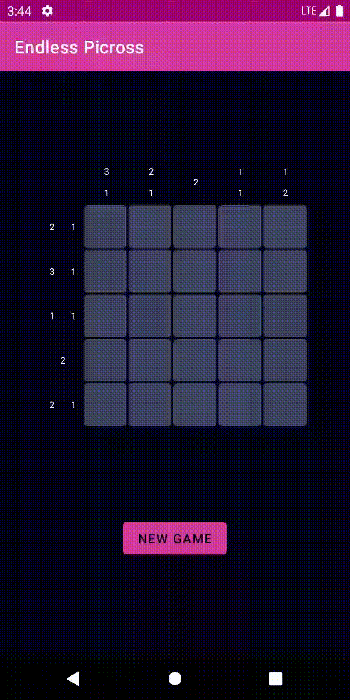

# Endless Picross

### Project 2 for ATLS 4120 - Mobile App Development

## About
A picross puzzle, also known as a Nonogram, is a picture logic puzzle in which cells in a grid must be colored or left blank according to numbers at the side of the grid. Typicially, this type of puzzle reveals a hidden image once completed, but I decided to randomize the puzzle creation process so the game could be replayable without having a large collection of puzzles. The game is meant to be endless by generating a new puzzle on every completion or by user request

## Recording
