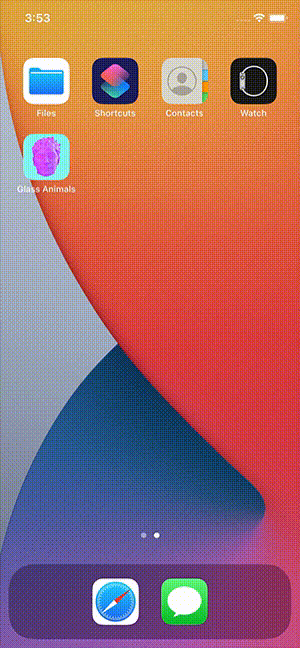

# Lab 1
### ATLS 4120 Mobile App Development

## Instructions
Create an app in a new Xcode project that includes the following:
- at least two buttons that change both an image and some text when tapped
- adaptive for all size iPhones in portrait orientation
- app icons
- launch screen

## Recording
