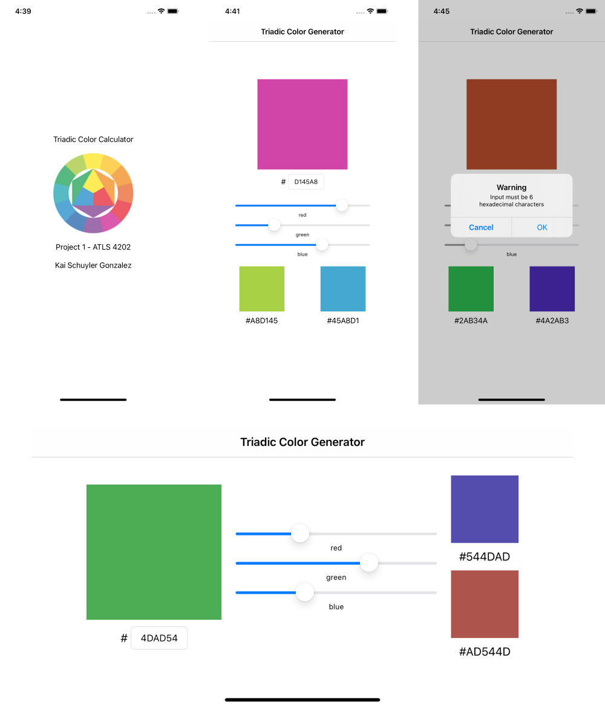

#  Triadic Color Calculator

### Kai Schuyler Gonzalez
### Project 1 for ATLS 4202 - Mobile App Development

## Project Instructions
__iOS app__
* Create a single view interactive iOS app. This could include apps that perform a calculation, respond to user input or selections, or respond to events in the app. I'm leaving this very open, so be creative here!

__Requirements:__
* Think of a creative idea or concept
* Focus on the design and user interaction
* The scope of your project should be larger than that of a lab
* Your app should adapt to all supported device configurations
* Your app should be complete with a launch screen and app icons

## Project Description
The user inputs a color (either in hexadecimal or rgb sliders), and the app calculates 2 "triadic colors". 

## MVP
The minimum functionality my app will meet is the following:=
* Users will be able to enter a color using hex codes
* Users will be able to enter a color using rgb sliders
* rgb sliders will update the colors while being dragged so users can select their color in a more precise way
* The app will calculate 2 colors from the user’s input that are triadic complements.

__Triadic calculation__
* I calculated triadic colors by rotating `r, g, b` values like so:
    ```
    original = #a1a2a3
    triadic1 = #a3a1a2
    triadic2 = #a2a3a1
    ```
* the source for this method is cited in the `ViewController.swift` file where relevant.

## Screenshots

